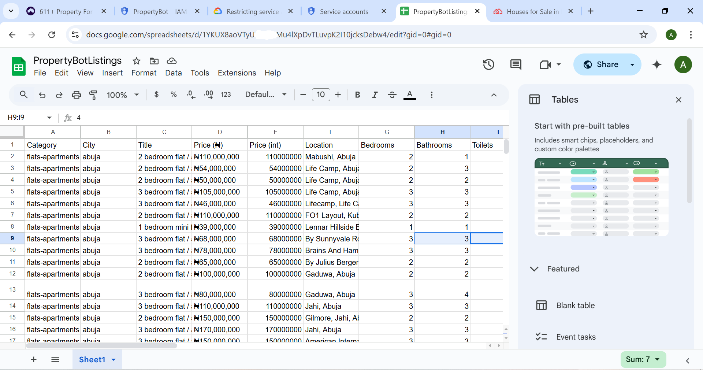
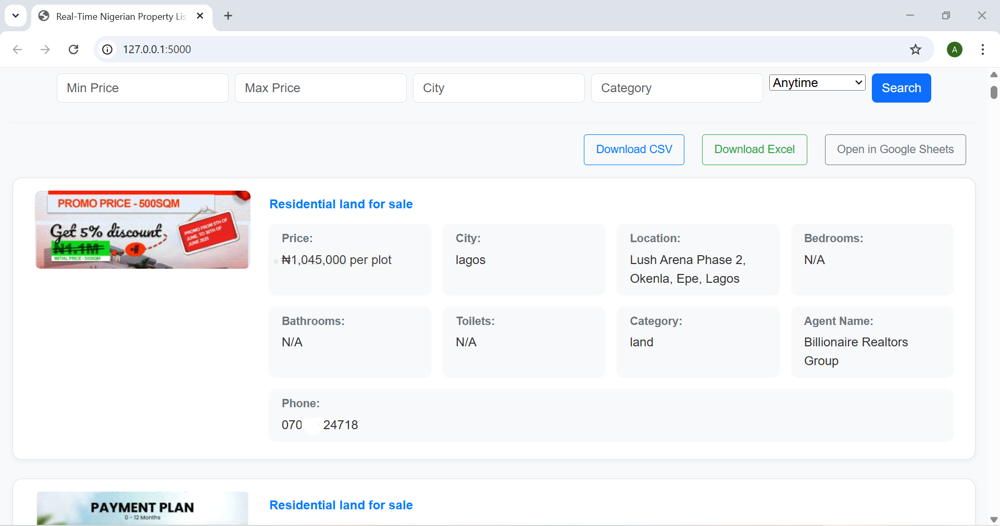

````markdown
# 🏡 PropertyBot

A powerful web scraping project that gathers real estate listings from major Nigerian property websites.

It provides a user-friendly Flask web interface to **filter**, **preview**, and **export** data into **CSV**, **Excel**, or **Google Sheets**.

---

## 📸 Sample Output

### 🧾 Google Sheets Export  


### 🌐 Web Interface  


---

## 📦 Features

- ✅ Scrapes property listings from:
  - NigeriaPropertyCentre.com
  - PropertyPro.ng
  - PrivateProperty.ng
- ✅ Extracts structured data: title, price, category, location, agent details, image URL, etc.
- ✅ Saves to **MongoDB**
- ✅ Flask web interface to:
  - Filter by city, category, price range, or date scraped
  - View paginated results
  - Export listings
- ✅ Export to:
  - **CSV**
  - **Excel**
  - **Google Sheets** via OAuth login
- ✅ Deduplicates listings
- ✅ Clean logging, error handling, modular layout

---

## 🗂 Project Structure

```plaintext
PropertyBot/
├── scrapers/
│   ├── NGPC_CRAWLER.py
│   ├── PPRO_CRAWLER.py
│   ├── PPNG_CRAWLER.py
├── pipelines/
│   ├── mongodb_pipeline.py
│   ├── remove_duplicates_script.py
├── middlewares/
│   └── user_agent_middleware.py
├── utils/
│   ├── sheet_writer.py
│   └── propertyAPIkeys.json
├── outputs/
│   ├── properties.csv
│   ├── googlesheet_snapshot.PNG
│   └── webapp.PNG
├── WebApp/
│   ├── server.py
│   ├── templates/
│   │   └── search.html
│   ├── static/
│   │   └── style.css
│   ├── .env
│   └── client_secret.json
├── .env
├── README.md
└── requirements.txt
````

---

## 🚀 Getting Started

### 1. Install dependencies

```bash
pip install -r requirements.txt
playwright install
```

---

### 2. Set up environment variables

#### Root `.env`

```
FLASK_SECRET_KEY=your-flask-secret-key
GOOGLE_SERVICE_KEY=utils/propertyAPIkeys.json
```

#### WebApp/.env

```
CLIENT_SECRET_FILE=WebApp/client_secret.json
FLASK_SECRET_KEY=your-webapp-secret-key
```

---

### 3. Run a scraper

```bash
python -m scrapers.NGPC_CRAWLER     # NigeriaPropertyCentre
python -m scrapers.PPRO_CRAWLER     # PropertyPro.ng
python -m scrapers.PPNG_CRAWLER     # PrivateProperty.ng
```

> Listings are stored in MongoDB under the `PropertyBot.listings` collection.

---

### 4. Launch the Web Interface

```bash
cd WebApp
python server.py
```

Then visit: [http://localhost:5000](http://localhost:5000)

---

## 📤 Export to Google Sheets

From the web interface:

1. Apply filters (e.g. city = Lagos, category = Flat)
2. Click "Export to Google Sheets"
3. Sign in with Google
4. A new spreadsheet is created in your Drive with your filtered results

✅ Exports are handled securely using OAuth 2.0 — no credentials are hardcoded.

---

## 🔐 Security Notes

This project is **Git-safe**. The following are ignored via `.gitignore`:

```
.env
**/.env
__pycache__/
*.pyc
outputs/
utils/propertyAPIkeys.json
WebApp/client_secret.json
```

> Make sure you **create your own `.env` files** and **do not commit your credentials** to GitHub.

---

## ✉️ Contact

**Author:** Abass Owolabi
📧 Email: [abassowolabi091021@gmail.com](mailto:abassowolabi091021@gmail.com)

💼 Available for freelance scraping work (Upwork, Fiverr, LinkedIn, etc.)

---

## 📝 License

This project is for educational and personal use only.
Always comply with a website’s **Terms of Service** when scraping data.

